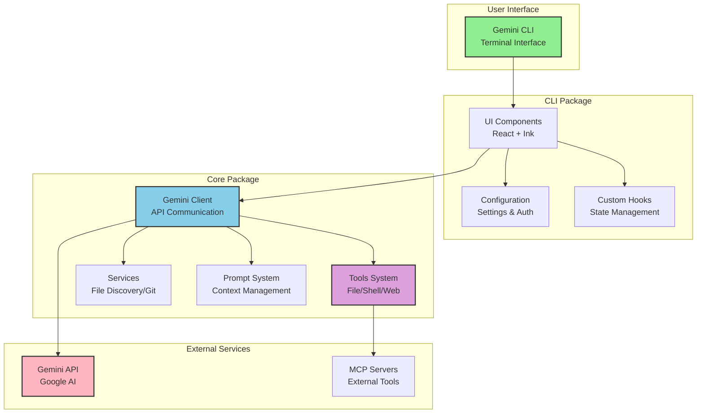

# Architecture Overview

```mermaid
graph TB
    subgraph "User Interface"
        CLI[Gemini CLI<br/>Terminal Interface]
    end

    subgraph "CLI Package"
        UI[UI Components<br/>React + Ink]
        Config[Configuration<br/>Settings & Auth]
        Hooks[Custom Hooks<br/>State Management]
    end

    subgraph "Core Package"
        Client[Gemini Client<br/>API Communication]
        Tools[Tools System<br/>File/Shell/Web]
        Services[Services<br/>File Discovery/Git]
        Prompts[Prompt System<br/>Context Management]
    end

    subgraph "External Services"
        API[Gemini API<br/>Google AI]
        MCP[MCP Servers<br/>External Tools]
    end

    CLI --> UI
    UI --> Config
    UI --> Hooks
    UI --> Client
    Client --> API
    Client --> Tools
    Client --> Services
    Client --> Prompts
    Tools --> MCP

    style CLI fill:#90EE90,stroke:#333,stroke-width:2px
    style Client fill:#87CEEB,stroke:#333,stroke-width:2px
    style API fill:#FFB6C1,stroke:#333,stroke-width:2px
    style Tools fill:#DDA0DD,stroke:#333,stroke-width:2px
```
