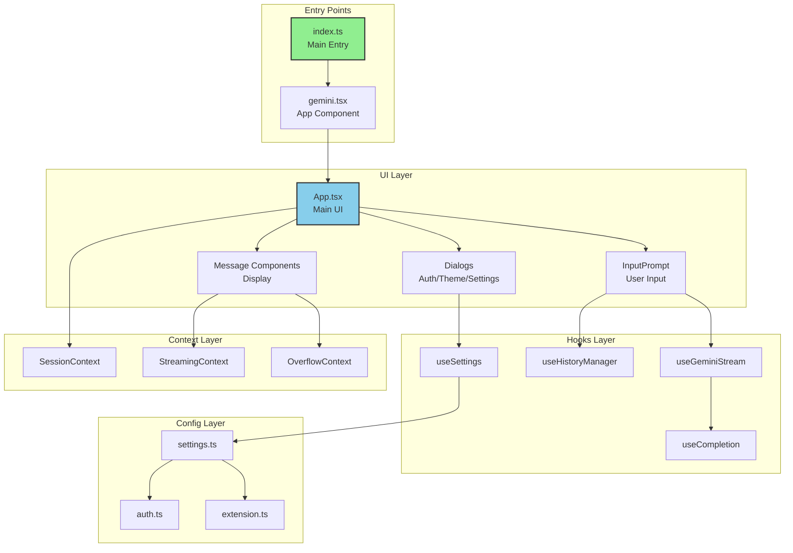

# CLI Components

```mermaid
graph TB
    subgraph "Entry Points"
        Main[index.ts<br/>Main Entry]
        Gemini[gemini.tsx<br/>App Component]
    end

    subgraph "UI Layer"
        App[App.tsx<br/>Main UI]
        Input[InputPrompt<br/>User Input]
        Messages[Message Components<br/>Display]
        Dialogs[Dialogs<br/>Auth/Theme/Settings]
    end

    subgraph "Hooks Layer"
        UseGemini[useGeminiStream]
        UseCompletion[useCompletion]
        UseHistory[useHistoryManager]
        UseSettings[useSettings]
    end

    subgraph "Context Layer"
        Session[SessionContext]
        Stream[StreamingContext]
        Overflow[OverflowContext]
    end

    subgraph "Config Layer"
        AuthConfig[auth.ts]
        Settings[settings.ts]
        Extension[extension.ts]
    end

    Main --> Gemini
    Gemini --> App
    App --> Input
    App --> Messages
    App --> Dialogs
    App --> Session
    Input --> UseGemini
    Input --> UseHistory
    Messages --> Stream
    Messages --> Overflow
    Dialogs --> UseSettings
    UseGemini --> UseCompletion
    UseSettings --> Settings
    Settings --> AuthConfig
    Settings --> Extension

    style Main fill:#90EE90,stroke:#333,stroke-width:2px
    style App fill:#87CEEB,stroke:#333,stroke-width:2px
```
