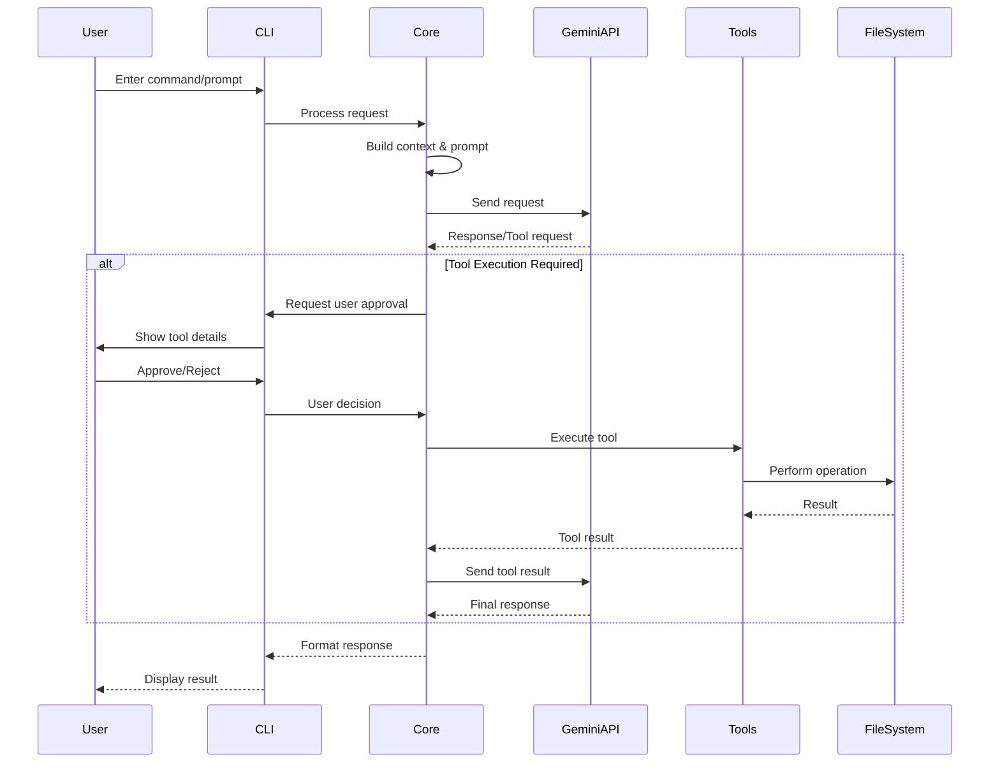

# Data Flow

```mermaid
sequenceDiagram
    participant User
    participant CLI
    participant Core
    participant GeminiAPI
    participant Tools
    participant FileSystem

    User->>CLI: Enter command/prompt
    CLI->>Core: Process request
    Core->>Core: Build context & prompt
    Core->>GeminiAPI: Send request
    GeminiAPI-->>Core: Response/Tool request

    alt Tool Execution Required
        Core->>CLI: Request user approval
        CLI->>User: Show tool details
        User->>CLI: Approve/Reject
        CLI->>Core: User decision
        Core->>Tools: Execute tool
        Tools->>FileSystem: Perform operation
        FileSystem-->>Tools: Result
        Tools-->>Core: Tool result
        Core->>GeminiAPI: Send tool result
        GeminiAPI-->>Core: Final response
    end

    Core-->>CLI: Format response
    CLI-->>User: Display result
```
