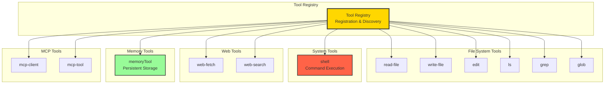

# Tools Ecosystem

```mermaid
graph TB
    subgraph "Tool Registry"
        Registry[Tool Registry<br/>Registration & Discovery]
    end

    subgraph "File System Tools"
        ReadFile[read-file]
        WriteFile[write-file]
        Edit[edit]
        LS[ls]
        Grep[grep]
        Glob[glob]
    end

    subgraph "System Tools"
        Shell[shell<br/>Command Execution]
    end

    subgraph "Web Tools"
        WebFetch[web-fetch]
        WebSearch[web-search]
    end

    subgraph "Memory Tools"
        Memory[memoryTool<br/>Persistent Storage]
    end

    subgraph "MCP Tools"
        MCPClient[mcp-client]
        MCPTool[mcp-tool]
    end

    Registry --> ReadFile
    Registry --> WriteFile
    Registry --> Edit
    Registry --> LS
    Registry --> Grep
    Registry --> Glob
    Registry --> Shell
    Registry --> WebFetch
    Registry --> WebSearch
    Registry --> Memory
    Registry --> MCPClient
    Registry --> MCPTool

    style Registry fill:#FFD700,stroke:#333,stroke-width:3px
    style Shell fill:#FF6347,stroke:#333,stroke-width:2px
    style Memory fill:#98FB98,stroke:#333,stroke-width:2px
```
